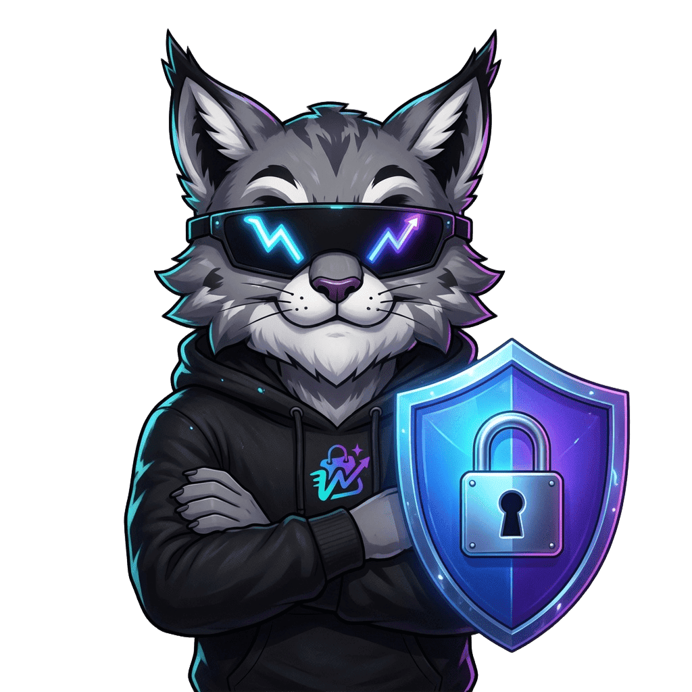

# WeKz Shop — Snippets de Código para Aplicação Direta

Copie e cole estes trechos nos locais indicados de cada arquivo.

---

## SNIPPET 1: wkz-core.js — Notificação Vazia com Mascote

**Localizar** (aproximadamente linha 2204):
```javascript
list.innerHTML = `<div class="wkz-inbox-empty">
      <svg width="36" height="36" viewBox="0 0 24 24" fill="none" stroke="rgba(148,163,184,0.4)" stroke-width="1.5" stroke-linecap="round" stroke-linejoin="round"><path d="M18 8A6 6 0 0 0 6 8c0 7-3 9-3 9h18s-3-2-3-9"/><path d="M13.73 21a2 2 0 0 1-3.46 0"/></svg>
      <p>Nenhuma notificação ainda</p></div>`;
```

**Substituir por:**
```javascript
list.innerHTML = `<div class="wkz-inbox-empty" style="display:flex;flex-direction:column;align-items:center;padding:24px 16px;">
      <path d=&quot;M18 8A6 6 0 0 0 6 8c0 7-3 9-3 9h18s-3-2-3-9&quot;/><path d=&quot;M13.73 21a2 2 0 0 1-3.46 0&quot;/></svg>'">
      <p style="margin:0;color:var(--muted);font-size:13px;">Nenhuma notificação ainda</p></div>`;
```

---

## SNIPPET 2: wkz-core.js — Modal Sair da Conta

**Localizar** (aproximadamente linha 5216):
```javascript
    var logoutIcon = '';
```

**Substituir por:**
```javascript
    var logoutIcon = '';
```

---

## SNIPPET 3: wkz-buyer.html — Meu Perfil (Mascote)

**Localizar** (aproximadamente linha 3549):
```html
    
```

**Substituir por:**
```html
    
```

---

## SNIPPET 4: wkz-buyer.html — Loja Oficial (Remover Badge)

**Localizar** (aproximadamente linha 3383):
```html
            <span class="wkz-kz-illus-badge" title="Loja Oficial WeKz"></span>
```

**Substituir por:**
```html
            <!-- [REMOVIDO] Badge loja-oficial conforme solicitado -->
```

---

## SNIPPET 5: wkz-legal.html — Página Anti-Fraude (Adicionar Mascote)

**Localizar** (aproximadamente linha 638-639):
```html
    <div class="inner-page-hero-inner">
      <div class="inner-breadcrumb"><span onclick="window.location.href='../buyer/wkz-buyer.html'">Home</span> › Anti-Fraude</div>
```

**Substituir por:**
```html
    <div class="inner-page-hero-inner">
      
      <div class="inner-breadcrumb"><span onclick="window.location.href='../buyer/wkz-buyer.html'">Home</span> › Anti-Fraude</div>
```

---

## SNIPPET 6: wkz-legal.html — Página Privacidade (Adicionar Mascote)

**Localizar** (aproximadamente linha 591-592):
```html
    <div class="inner-page-hero-inner">
      <div class="inner-breadcrumb"><span onclick="window.location.href='../buyer/wkz-buyer.html'">Home</span> › Privacidade & LGPD</div>
```

**Substituir por:**
```html
    <div class="inner-page-hero-inner">
      
      <div class="inner-breadcrumb"><span onclick="window.location.href='../buyer/wkz-buyer.html'">Home</span> › Privacidade & LGPD</div>
```

---

## SNIPPET 7: wkz-kz-illustrations.css — Adicionar Estilos

**Adicionar ao final do arquivo** (antes da última chave `}` se houver, ou no final):

```css
/* ── NOVOS ESTILOS — Perfil Hero (v2.1) ─────────────────────────────── */
.cp-hero { position: relative; overflow: visible; }

.wkz-kz-illus-profile {
  position: absolute;
  right: 12px;
  top: 10px;
  max-height: 110px;
  width: auto;
  z-index: 1;
  opacity: 0.9;
  pointer-events: none;
}

@media (max-width: 760px) {
  .wkz-kz-illus-profile {
    position: relative;
    right: auto;
    top: auto;
    display: block;
    margin: 0 auto 12px;
    max-height: 90px;
    z-index: auto;
  }
}
```

---

## 📁 Imagens para Verificar/Adicionar

Copie as imagens fornecidas para `assets/mascot/`:

1. **seguranca.png** → `assets/mascot/seguranca.png` (para páginas de segurança)
2. **notificacao.png** → `assets/mascot/notificacao.png` (para notificações)
3. **favorito.png** → `assets/mascot/favorito.png` (para favoritos - verificar se já existe)

Se as imagens estiverem em `../shared/assets/mascot/` no GitHub, ajustar os paths conforme necessário.
